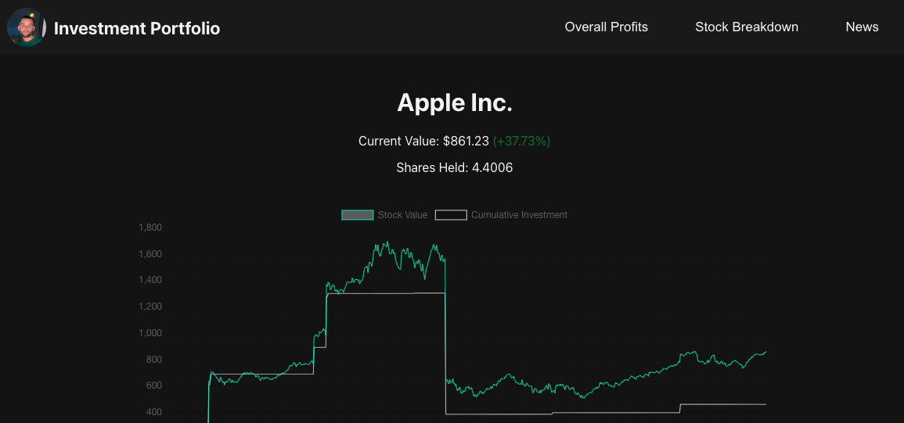
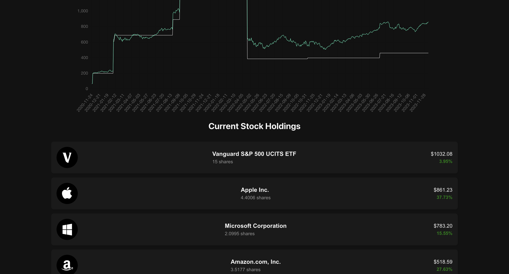
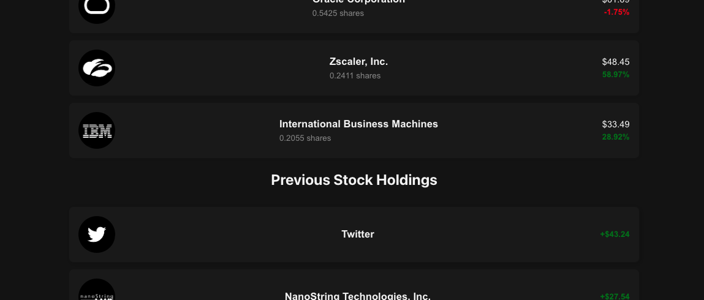
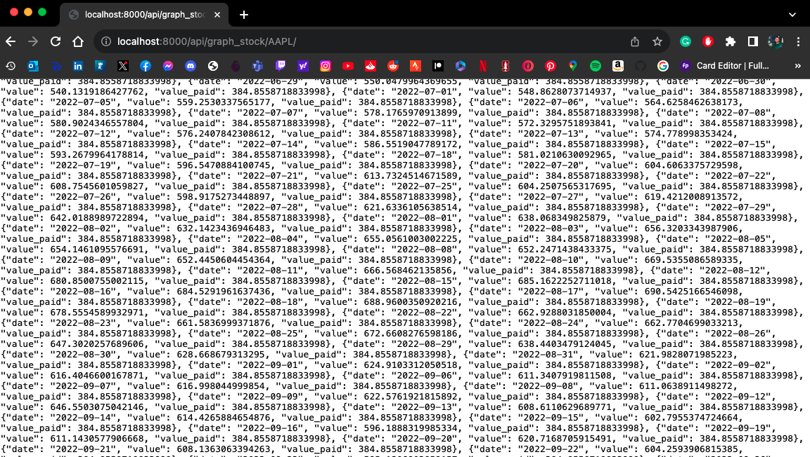

# Investment Portfolio Website
## What does it do?
- Using screenshot images of stock purchases form a csv of market transactions and history
- Analysing investment data from csv to prepare for visualisation
- Visualising investment data on graphing library
- Turning csv into a JSON file to be used in Database for transactions
- Making a React js front end to visualise my investments and graphs
- Setting up Django backend to feed API data from the database for display on react
- Live data using yfinanace and refreshing to get constant gain/loss percentages
- Each stock is a button that shows breakdown of that stock holding on a graph
### What do I still need to make it do?
- Other tabs for specific breakdowns
- Overall portfolio graph
- Formatting react app for smaller screens & phone screens
- Daily/Monthly/Yearly View

